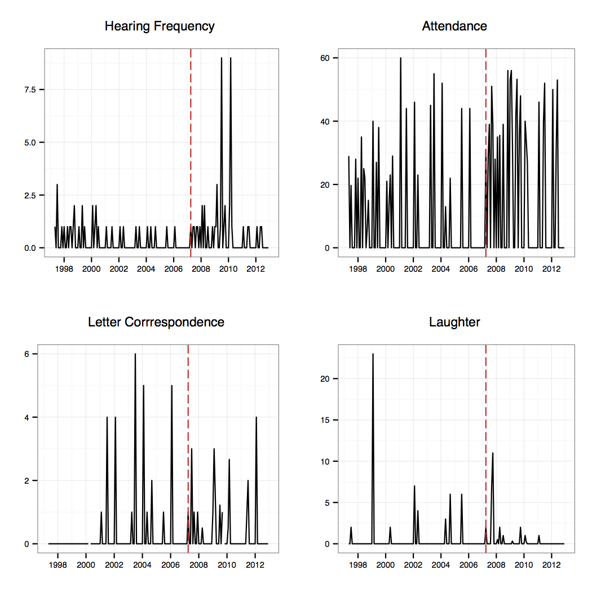
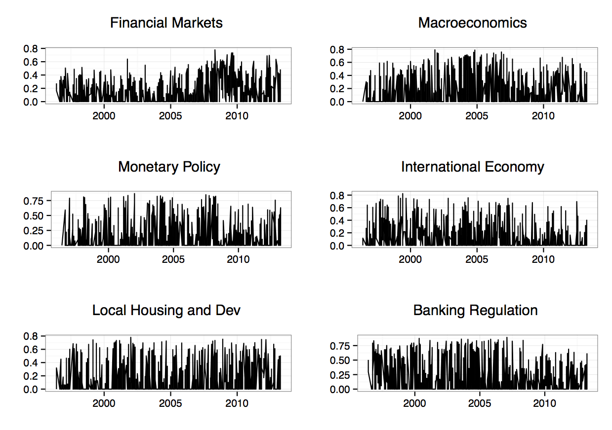
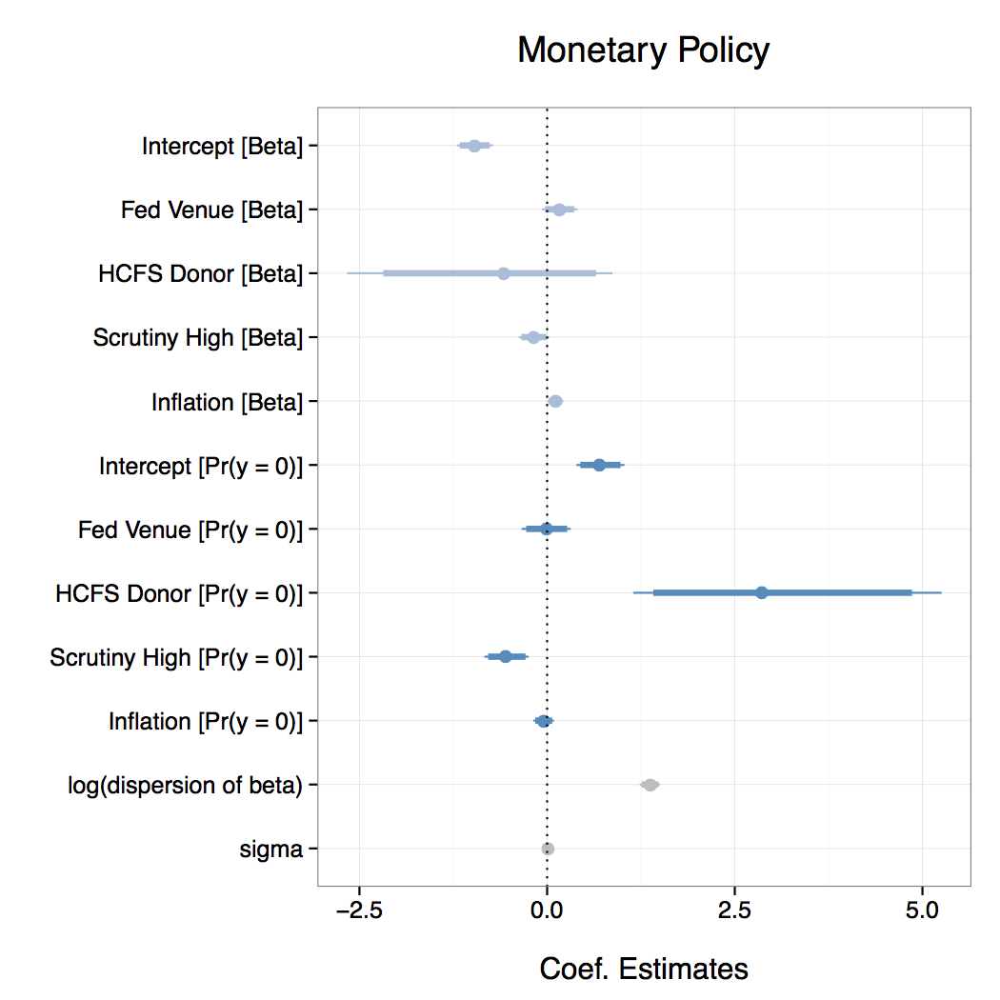
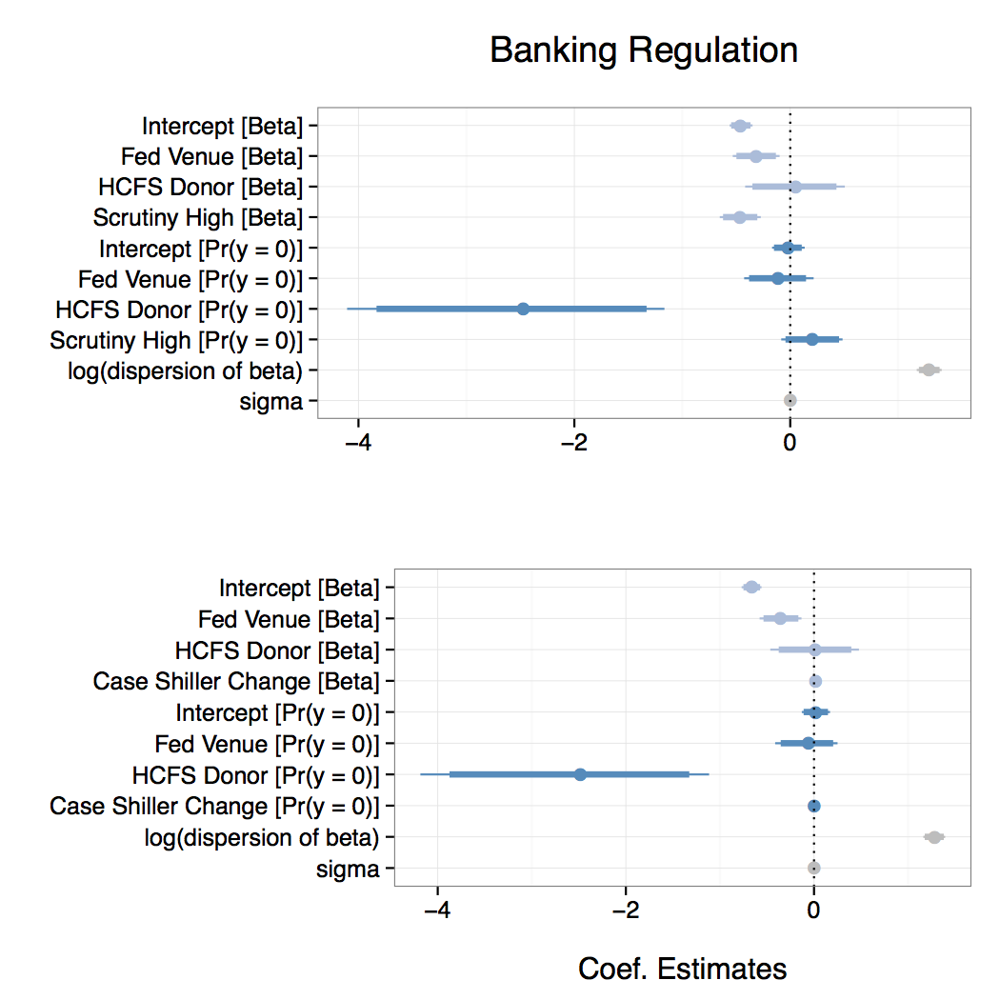

## Research overview

Understanding how monetary policymakers' use **communication** (speeches +
press releases) to:

- respond to their **political principals**

- create **credibility**

## Developed vs. Developing

Monetary policymakers:

- **Developed**: tend to have **established**
credibility and autonomy and may be using communication to **protect** it.

- **Developing**: **trying to establish**
these qualities.

## Monetary policymaking in developed economies (US)

- What do monetary policymakers **consider stressful**?

    + Poor performance in mandated areas?

    + Poor performance in something else (e.g. housing)?

- What **non-policy tools** do they use to **respond** to this stress?

    + Reaching out to important interest groups?

    + What they talk about?

## Monetary policymaking in developing economies (India)

- How is monetary policy **communication credibility** created?

- What impact do central bank governor **appointments** have on communication
credibility?

## Issues (1)

> Data (i.e. text) **availability**. Limited series of easily machine
readable texts.

## Issues (2)

> **Integrating disparate types** of information, including multiple estimated
quantities.

## Issues (3)

> Identifying **state changes** in complex data.

## Issues (4)

> Needing to **define a priori** features of the underlying quantities.

## Issues (5)

> **Showing** results from models where **topic proportions** are **dependent
variables**.

## Data availability (US Federal Reserve Project)

All (> 1100) Fed governor **speeches** from June
1996 through present are easily accessible.

Government Printing Office has House and Senate **transcripts** from 2001-2012
accessible. **Filled in** with Committee websites, so:

- House: 188 transcripts from May 1997-2012

- Senate: 144 transcripts from 2001-2012

## Data availability (US Federal Reserve Project)

Effectively, our data is limited to the late 1990s through (about) the
present.

Greatly **limits the generalisability** of our findings as this is a very
particular period of US monetary policy-making.

More work needs to be done **creating corpora** of legislative and
monetary policy-making transcripts.  

Should be **easily and freely accessible** to improve **scientific
efficiency**.

## Data Availability (Resere Bank of India Project)

All **speeches** made by central bank governors and deputy governors
930 documents (1990 to present).

All **press releases** (1990 to present).

All **news articles** mentioning the Reserve Bank of India and/or its officials
~14000 documents (2000 to present; five leading Indian English newspapers).

Again, limited to a **specific and particular period of time**.

## Integrating disparate types of information (US)

- Speeches (topic modelling),

- Scrutiny (change point analysis of Congressional hearings),

- Speech locations (Congressional donor?)

- Macroeconomic (e.g. inflation, Case-Schiller housing price index)

Ballooning **researchers degrees** of freedom.

Difficult to fully document in one article, but are each **publishable on their
own?**

## Integrating disparate types of information (India)

Aim to compare **sentiments** in monetary policy communication with
sentiments in corresponding news articles.

**Key assumption**: the **difference** between measures from these two
sources will give us an indication of how credible the RBI's communication is.

- Can examine changes over time.

Is this a **valid indicator**?

## Identifying state changes

Posit that there are different "**scrutiny states**" (e.g. low, high).

Each month or congressional hearing is not independent. But there is some
underling scrutiny state that spans months.

Currently we use **multi-variate change point analysis** [@Matteson2014].

Change point identification + interpretation -> variable with values:
$[low,\: high]$

**Prior experience** of change point + text analysis?

How **valid** is this? What type of **robustness checks** could we conduct?

## Defining features a priori

Non-parametric change point methods [e.g. @Matteson2014] require **minimum
state lengths** to be determined a priori.

Topic modelling with Latent Dirichlet Allocation requires a priori
specification of **number of topics**.

## Attempts to justify assumptions

Guided by **substantive prior knowledge** + what we **learn from the
data**.

- **Rule of thumb for change point**: aim for the smallest substantively
meaningful minimum size to avoid arbitrarily ignoring shorter clusters.

- **Rule of thumb for topic modelling**: smallest number of topics without
overlap.

## Change Point in House Hearings

## Topic proportions from Fed Speeches

## Defining features a priori

Nonetheless **reviewers seem to be skeptical** of methods where features of
the data need to be defined a priori.

How to overcome this skepticism?

## Showing results from regressions with proportion dependent variables

Topic proportion data is in $[0,\:1]$ or (more likely) $[0,\:1)$.

**Zero-Inflated Beta Regression** [e.g @ospina2010inflated] is useful in this
context.

- Utilises a **mixed discrete-continuous** distribution

    + Bernoulli distribution used for the discrete component, e.g.
    $\mathrm{Pr}(y = 0)$.

    + Beta distribution used for the continuous component, e.g. $0 < y < 1$

## Showing results from Zero-Inflated Beta Regression

Beta regression and Zero-One inflated Beta regression gives **results** that
many audiences find very **confusing**.

Coefficient signs for the discrete and continuous parts have **opposite
interpretations**.

- Positive coefficient in continuous part indicates **topic is spoken about
more**.

- Positive coefficient in discrete part indicates higher probability of
**not discussing a topic at all**.

## Predicting Fed topics in speeches

## Predicting Fed topics in speeches

---

> Suggestions and comments very welcome.

## References
